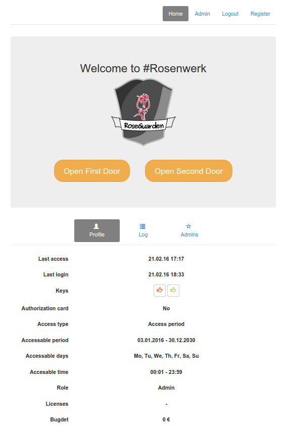

RoseGuarden
===========

A remote door api and web application for Raspberry Pi, Odroid, Orange Pi or BeagleBoard (based on python).

Quickstart
==========

Initial steps
-------------

- add your `MAIL_USERNAME` to your enviroment variables (for enabling mail service, default mail-server-configuration is for googlemail)
- add your `MAIL_PASSWORD` to your enviroment variables (for enabling mail-service, default mail-server-configuration is for googlemail)
- initialize RoseGuarden database in the `server` - directory with `python db_create`

Running RoseGuarden
-------------------

- start the HTTPServer in the `client` - directory with  `python -m SimpleHTTPServer 8000`
- start the RoseGuarden-app in the `server` - directory with `python run.py`

Screenshots (Software)
======================

Hardware
========

The hardware consists of the following electronics mounted on a board.

- the control unit (Rapsberry Pi, Orange Pi, Beagleboard or Odroid): running the Python based app and server.
- a RFID-reader (e.g. RC552): reading and writing the tags
- a relay-module: controling the door-openers
- a dc-dc-converter: supplying the control unit

Case and Mounting
-----------------

The case ist modeled with the powerful open source software FreeCAD. Have a look in the hardware folder for the current stable version of the board and its case. It is designed to be 3d-printed with dimensions of 145mm x 145mm. The design uses suckers to mount the device to windows or doors. With a few modifications you can also use screws for a more stable mounting. Be aware that the RFID-Signal could only reach throw 30mm non-metallic walls or glass. 

 

Feel free to change the design to your needs. Please share your changed designs and new versions with the community (push request). 

Assembly
--------

To assemble the components, you only need some additional M2 and M3 screws to put the electronics on the board. While using other electronics than recommended, change the board modell to your needs. The positions are marked for easy assembly. The cable can put throw cable holes and routed along dedicated bolts.

Further Documentation
=====================

Further documentation and information on components and installation could be found on the project-wiki http://h2371910.stratoserver.net/projects/tuer-und-geraeteverwaltung-rosenguarden/wiki/Wiki (german language only, please translate via google translate or other services).

License
=======

RoseGuarden is published under the terms of the GPL v3 license. See [LICENSE](LICENSE).
