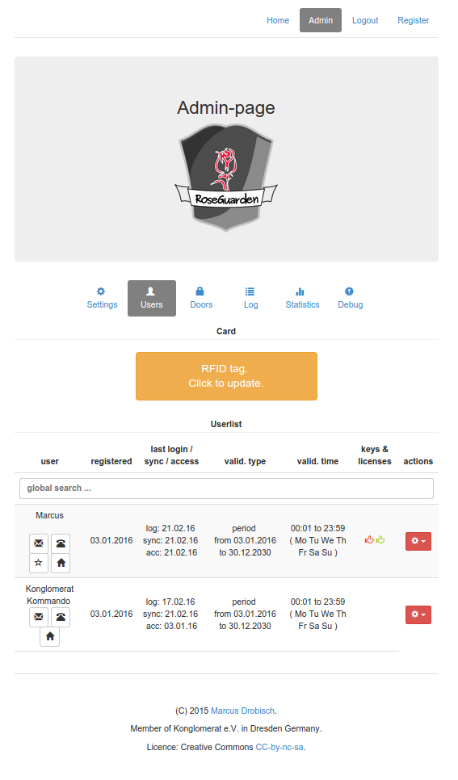
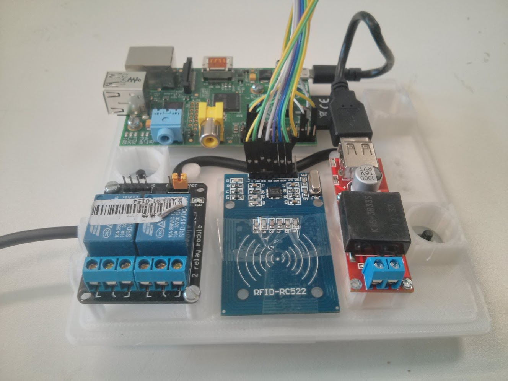
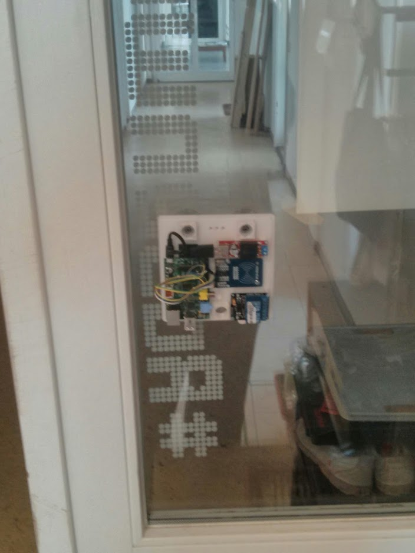
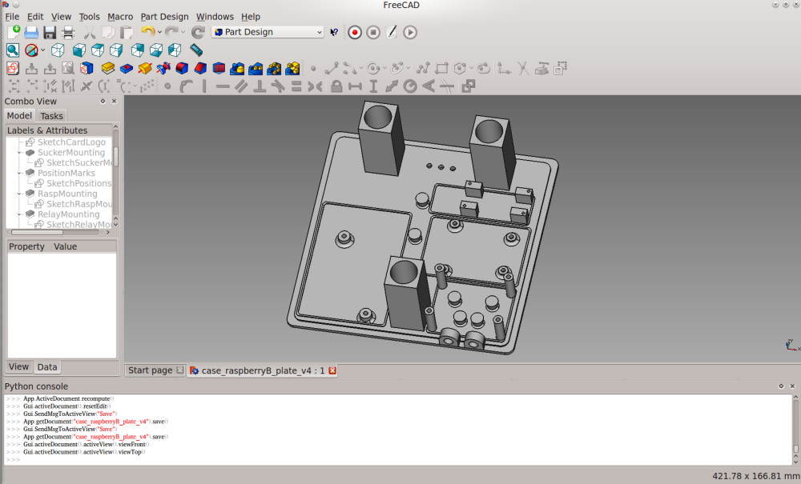
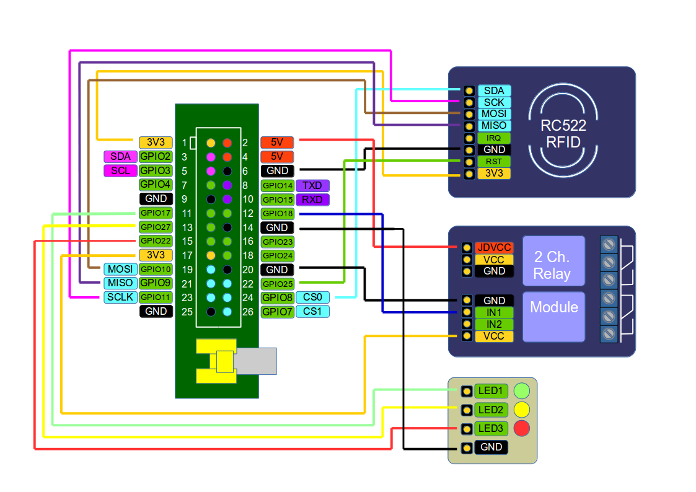

RoseGuarden
===========

A remote door api and web application for Raspberry Pi, Odroid, Orange Pi or BeagleBoard (based on python).

Quickstart
==========

Install RoseGuarden
-------------------

Clone the repository to your installation path with `git clone https://github.com/blinzelaffe/roseguarden.git`

Install dependencies
--------------------

First of all update and upgrade your raspberry pi os

1. sudo apt-get update
2. sudo apt-get upgrade

For the frontend we need nodejs to get a module called bower. Bower will handle alls the frontend dependencies.
You can install the most actual package like this.

3. wget http://node-arm.herokuapp.com/node_0.10.36_armhf.deb
4. sudo dpkg -i node_0.10.36_armhf.deb

Note: for the old raspberry pi the nodejs 0.10.36 is the most actual version. Newer version have problems with the c++ libaries (date 2015-10-93).
Have a look at http://weworkweplay.com/play/raspberry-pi-nodejs/ for further informations and instructions.

Now we could install bower and let bower get us the packages for the frontend (css, angularjs, smarttable, etc.).
For this step you have to switch to the `client`-directory and prompt

5. sudo npm install -g bower
6. install the bower packages with `bower install` (in the `client`-directory install)

Now the frontend is ready.

For the backend (python) we have to install dependecies, too.
The python package manager `pip` will handle this for us. So we need to install `pip` like this.

7. sudo apt-get install python-pip

At this point we will get the python packages list in the `requirement.txt` file.
Switch to the `server`-directory and prompt.

8. `pip install -r requirements.txt` ()in the `server`-directory)

Initial steps
-------------

- add your `MAIL_USERNAME` to your enviroment variables (for enabling mail service, default mail-server-configuration is for googlemail)
- add your `MAIL_PASSWORD` to your enviroment variables (for enabling mail-service, default mail-server-configuration is for googlemail)
- initialize RoseGuarden database in the `server` - directory with `python db_create`

Running RoseGuarden
-------------------

- start the HTTPServer in the `client` - directory with  `python -m SimpleHTTPServer 8000`
- start the RoseGuarden-app in the `server` - directory with `python run.py`

Screenshots (Software)
======================

Hardware
========

The hardware consists of the following electronics  types mounted on a board.

- the control unit (Rapsberry Pi, Orange Pi, Beagleboard or Odroid): running the Python based app and server.
- a RFID-reader (e.g. RC552): reading and writing the tags
- a relay-module: controling the door-openers
- a dc-dc-converter: supplying the control unit with a input  of e.g. 12V / 24V and a output of 5V
- a micro-usb cable of 30cm length: connect dc-dc-converter to the control unit
- some internal cable: e.g. from dc-dc converter to the relay module or to the raspberry pi

Screenshots (Hardware)
----------------------

Here some photos of the assembled and mounted Roseguarden device in the early stage.

 

 

Recommended bill of material
----------------------------

We recommend the following devices, to use on the provided case:

- Rapsberry Pi 1 B (found on watterot, rs online, digikey)
- KIS3R33S dc-dc converter (found on ebay from various distributoirs from about 3€ per piece)
- RC552 rfid reader, including 2 rfid-tags (found on ebay from various distributors from about 3€ per piece)
- SainSmart 2 ch. relay module or compatible (found on ebay from various distributors and producers from about 3€ per piece)
- the 3d-printed case on below
- 4 x M2 and 10 x M3 screws to mount the electronic to the case

additional for connecting and supllying the device:

- some breadboard female-female connector (found on pollin, watterot or sparkun)
- some cable with at least 3 wires @ 1A (found on pollin, reichelt, digikey or your local electronic store)
- a ethernet-patch-cable (found on pollin, reichelt, digikey or your laocal electronic store)
- or a wifi-dongle (found on pollin, reichelt, digikey or your laocal electronic store)

additional for mounting the device on walls or doors:

- suckers with 40mm diameter and M4-bolts (found on ebay from various distributors from about 7€ per 10 pieces)
- or glue tape for mounting
- or screws for mounting 

Case and Mounting
-----------------

The case ist modeled with the powerful open source software FreeCAD. Have a look in the hardware folder for the current stable version of the board and its case. It is designed to be 3d-printed with dimensions of 145mm x 145mm x 60mm. The design uses suckers to mount the device to windows or doors. With a few modifications you can also use screws for a more stable mounting. Be aware that the RFID-communication could only reach throw about 30mm non-metallic walls or glass (+ aboout 20mm rfid-module-to-wall distance). 

 

Feel free to change the design to your needs. Please share your changed designs and new versions with the community (by asking for a push request). 

Assembly
--------

To assemble the components, you only need some additional M2 and M3 screws to put the electronics on the board. While using other electronics than recommended, change the board modell to your needs. The positions are marked for easy assembly. The cable can put throw cable holes and routed along dedicated bolts.

The schematic show the connection between raspberry pi and the modules.

Further Documentation
=====================

Further documentation and information on components and installation could be found on the project-wiki http://h2371910.stratoserver.net/projects/tuer-und-geraeteverwaltung-rosenguarden/wiki/Wiki (german language only, please translate via google translate or other services).

License
=======

RoseGuarden is published under the terms of the GPL v3 license. See [LICENSE](LICENSE).
